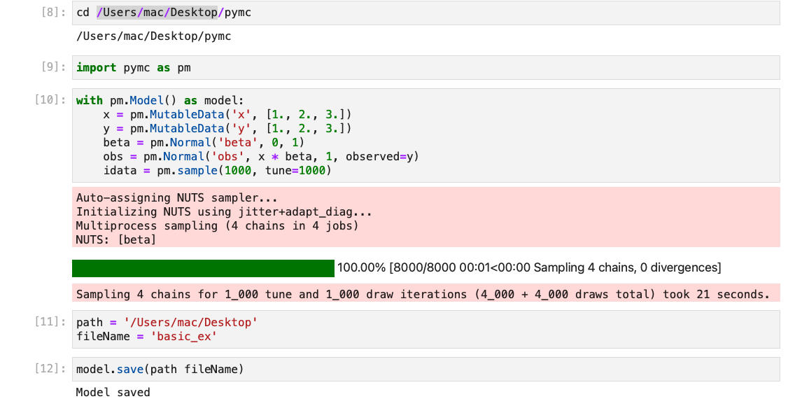

### Week 0-1
Goals:
* Set up a working repository and enviourment to test methods of base class
* Log progress future refrence
### Test searlisation of PyMC models to save
* Understood working of searlisation methods using pickle and joblib [notes of serialisation]
* Tested working of cloudpickle for pickling the PyMC models
* Check saved pickle file and load it back to see if saving has worked in correct manner  

* Extended Goals
    - [ ] Give option to save different extentions using cloudpickle
    - [ ] Give an option to save by value or save by refrence (refer to cloudpickle documentation for this)

* Made a load function to to load saved model uising cloud pickle

* inherit base class to Model class in `pymc/model.py`
* Added methods to `save` and `load` model using `super` Function

* Testing it out on a basic model
