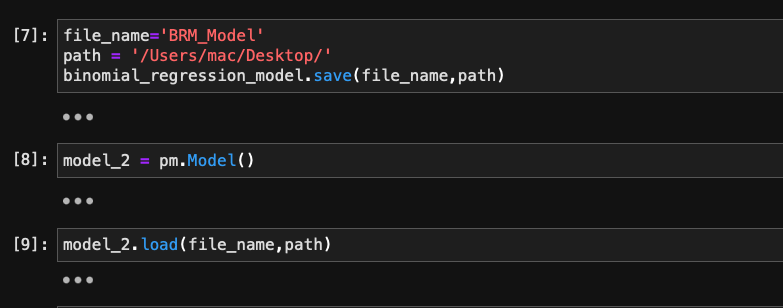

### Week 2
#### Extended Goals (continued)
- [ ] Give option to save different extentions using cloudpickle
- [ ] Give an option to save by value or save by refrence (refer to cloudpickle documentation for this)

* Since save and load methods worked fine try it out on other examples
* find PyMC exampels to try out new save and load methods
* cloned pymc-devs/pymc-examples

* find PyMC exampels to try out new save and load methods  
`git clone pymc-devs/pymc-examples`
* tested save and load on [GP-Binomial Regression](https://www.pymc.io/projects/examples/en/latest/generalized_linear_models/GLM-binomial-regression.html)

* tested save and load methods on other models. Examples tested :
    * [Gaussian Process for CO2 at Mauna Loa](https://docs.pymc.io/en/v3/pymc-examples/examples/gaussian_processes/GP-MaunaLoa.html)
    * [Bayesian Neural Network](https://github.com/pymc-devs/pymc-examples/blob/main/examples/variational_inference/bayesian_neural_network_advi.ipynb)
    * [Gausian Process Kron](https://github.com/pymc-devs/pymc-examples/blob/main/examples/gaussian_processes/GP-Kron.ipynb)
    * [GLM-hierarchical](https://github.com/pymc-devs/pymc-examples/blob/main/examples/generalized_linear_models/GLM-hierarchical.ipynb)
### Final Extended Goals of the week
- [ ] Give option to save different extentions using cloudpickle
- [ ] Give an option to save by value or save by refrence (refer to cloudpickle documentation for this)
- [ ] Add model versioning